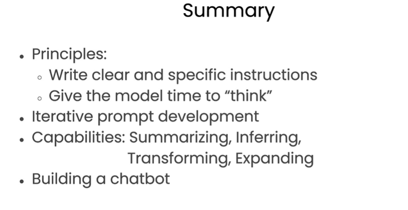

### ChatGPT Prompt Engineering for Developers 

This course is about ChatGPT Prompt Engineering for Developers provided by DeepLearning.ai.  

There's been a lot of material on the internet for prompting with articles like prompts everyone has to know. A lot of that has been focused on the chatGPT web user interface, which many people are using to do specific and often one-off tasks. 

However,  the features and benefits inherent to LLMs have the potential to expand beyond conventional applications. Especially within the realm of software developers, there is an opportunity to explore these wonderful tools through dedicated API calls to LLMs. This allows for greater agility in creating high-quality and high-performance software applications

